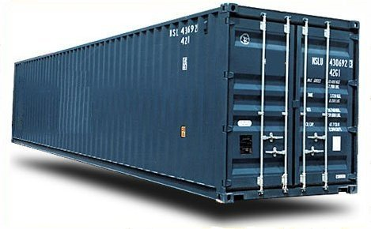

!SLIDE
# Déroulement 

1. Intro 
2. LXC
3. Docker
4. Démo

!SLIDE
# Quel problème veut il résoudre ?

Avec la multiplication des stacks (applicatifs, OS, plateformes), il devient fastidieux de gérer les installations.

!SLIDE
# Objectif

Automatiser le déploiement d'environnements sous forme de :

* conteneur léger
* portable
* auto-suffisant
* qui peut fonctionner un peu partout

http://www.docker.io

!SLIDE
# Cas d'utilisation

* Environnement de développement
* Deploiement
* Lancement des tests
* Test du système

!SLIDE full

!SLIDE full

!SLIDE full

!SLIDE
# Histoire du conteneur

Le premier bateau porte-conteneur, le Ideal-X, part le 26 avril 1956 du port de Newark (New Jersey) vers le port de Houston (Texas). A son bord, 58 conteneurs de 35 pieds.

*Note* : 35 pieds était le standard USA des camions.

!SLIDE full

!SLIDE
# Histoire du conteneur

Invention de Malcom McLean (1914-2001), magnat dans le transport routier, qui avait calculé que le coût passerait de 5.83$ la tonne à 0.16$ en passant par Ideal-X. Les containeurs ont donc **réduit les coûts de transport cargo de 90%**.

Note : Il fonda la société SeaLand, racheté en 1999 par Maersk, leader mondial du conteneur.

!SLIDE full

!SLIDE
# Caractéristiques d'un conteneur

* Agnostique sur le contenu
* Agnostique sur le transporteur
* isolation
* Automatisation
* Efficace

!SLIDE
# Projet jeune

* 18/01/2013 : 1er commit
* 01/02/2013 : 1ere démo en ligne
* 21/03/2013 : 1ere démo à Pycon US
* 26/03/2013 : Ouverture du dépôt GitHub
* 03/06/2013 : Version 0.4
* 25/06/2013 : Rejoint la fondation Linux
* 18/07/2013 : Version 0.5
* 23/08/2013 : Version 0.6
* 23/09/2013 : Version 0.6.3
* 16/10/2013 : Version 0.6.4
* 29/10/2013 : Version 0.6.5

!SLIDE
# Projet actif

Dans le Top 15 sur GitHub.

Au 25/09/2013, 3389 commits, 975 PR et 169 contributeurs.

!SLIDE
# Pré-requis 

Pour l'instant, Ubuntu est la cible privilégié : 

* Kernel Linux 3.8+ (avec Cgroups et namespaces activées)
* AUFS
* LXC
* 64 bits
